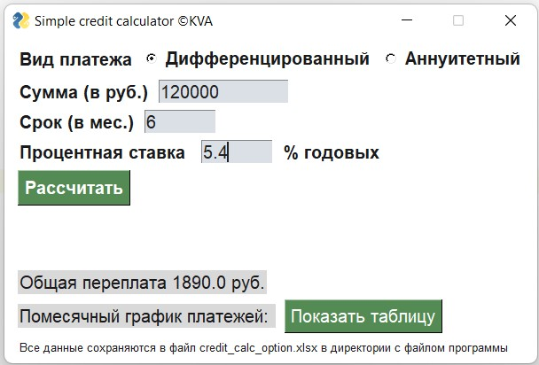
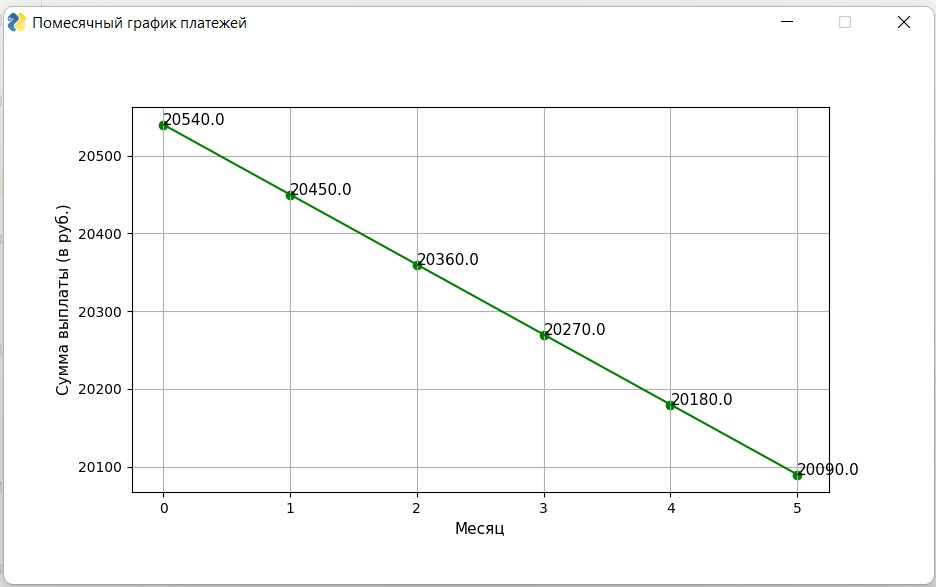
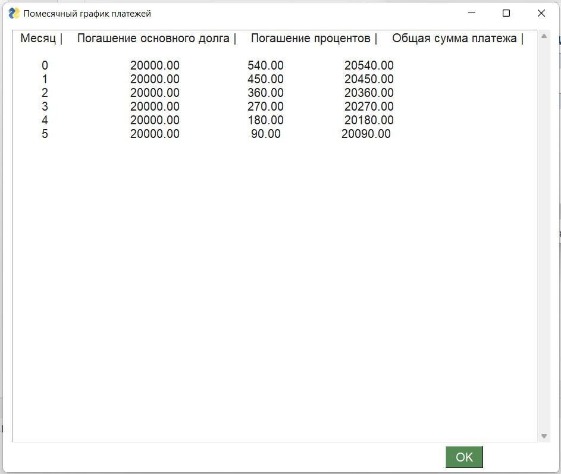
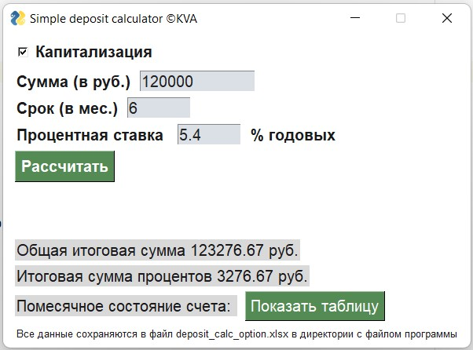
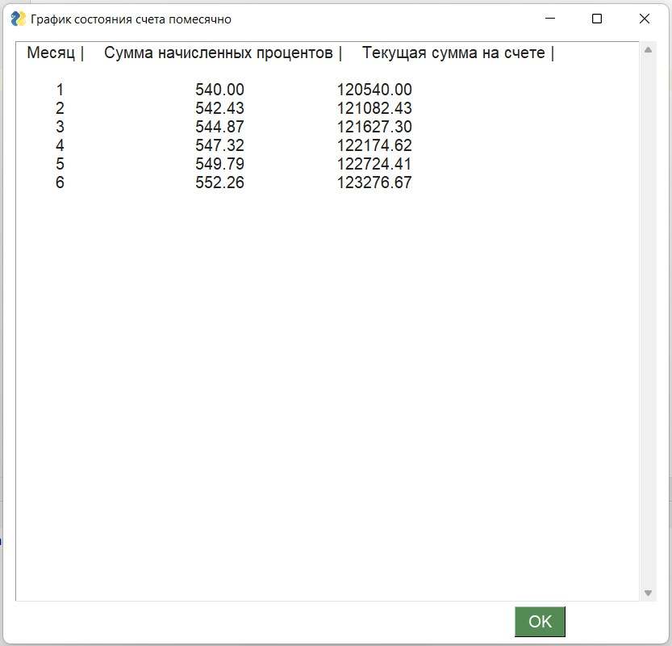

# bank-informatics
4th course, labs, GUI

## How to run 
Take the `.py` files or just load `.exe` apps

## About credit calculator
This calculator is in 3 versions of displaying the schedule for differential payment:
- useless graph
- nice but impractical table
- simple usefull table

### Screenshots

## About deposit calculator

### Screenshots

